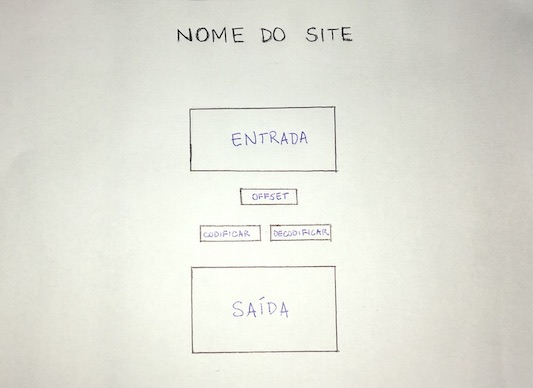
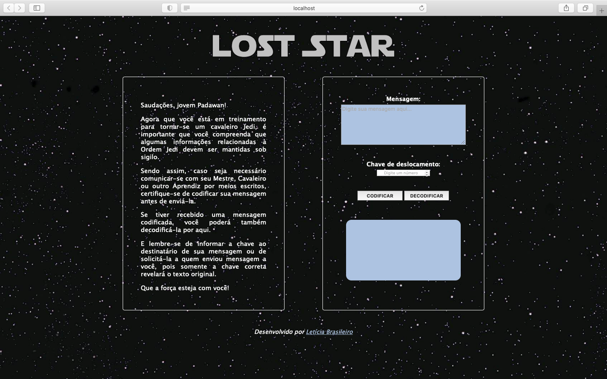

# Cifra de César - LOST STAR
Cifre e decifre mensagens secretas!

## Índice

* [1. Introdução](#1-introdução)
* [2. Tema](#2-tema)
* [3. Usuário](#3-usuário)
* [4. Como utilizar](#4-como-utilizar)
* [5. Processo e decisões](#5-processo-e-decisões)
* [6. Considerações gerais](#6-considerações-gerais)


***

## 1. Introdução

Este projeto foi desenvolvido a partir da proposta de criar uma aplicação _web_ 
que fosse capaz de codificar e decodificar uma palavra ou texto utilizando a 
[Cifra de César](https://pt.wikipedia.org/wiki/Cifra_de_C%C3%A9sar), que é um 
tipo de cifragem por substituição, em que cada letra do texto original é 
substituida por outra, pertencente ao mesmo alfabeto, mas que se encontra deslocada 
a um número fixo de posições à direita ou à esquerda.


## 2. Tema

A aplicação [**LOST STAR**](https://letbrasil.github.io/SAP005-cipher/src/) foi 
inspirada no universo **Star Wars**. No decorrer dos filmes conhecemos a Ordem Jedi, 
uma organização de indivíduos com grande conhecimento dos segredos da Força -- 
razão pela qual se faz importante proteger certas informações para que não caiam 
em mãos erradas.


## 3. Usuários

Destinado aos _Padawans_ (jovens que estão em treinamento para um dia serem Cavaleiros
Jedi) que necessitem tratar de assuntos relacionados à Ordem Jedi e à Força por via escrita. 
Para manter o conteúdo de suas mensagens em segurança, Padawans e Cavaleiros (e, em alguns 
casos, Mestres Jedi) utilizam esta aplicação para codificar/decodifcar mensagens e evitar
vazamento de informações.


## 4. Como utilizar

Ainda que você não seja um Padawan, Cavaleiro ou Mestre Jedi, você pode acessar a aplicação
clicando [aqui](https://letbrasil.github.io/SAP005-cipher/src/)!

### Para codificar:

* digite sua mensagem;
* escolha um número para a chave de deslocamento;
* clique no botão **CODIFICAR**;
* a mensagem codificada será exibida no campo logo abaixo.

### Para decodificar:

* digite a mensagem recebida e já codificada;
* digite o número da chave de deslocamento utilizada para a codificação;
* clique no botão **DECODIFICAR**;
* a mensagem original será exibida. 


## 5. Processo e decisões

### Organização

A idealização e a lista das tarefas a serem executadas foram organizadas 
utilizando anotações e alguns desenhos, ambos feitos à mão, além do uso de post-it.

Para desenvolver a aplicação, imaginei um pequeno fluxograma:

```text
                                                ┌──> CODIFICAR ──┐
                                                │                │
INÍCIO ──> MENSAGEM DIGITADA ──> DESLOCAMENTO ──│                │──> RESULTADO ──> FIM
                                                │                │
                                                └─> DECODIFICAR ─┘
```

### Interface

Com base no fluxograma, desenhei a interface inicial:



Pensando na facilidade de uso e entendimento, optei por uma interface simples, 
com apenas 2 campos de entrada (mensagem original e deslocamento), 1 campo de saída 
(mensagem cifrada ou decifrada) e 2 botões ("CODIFICAR" e "DECODIFICAR").

Durante o processo de estilização, um texto foi escrito para dar imersão ao tema. 
aos poucos a página foi tomando forma e esta é a interface final:



## 6. Considerações gerais

* Para o desenvolvimento deste projeto foram usados HTML, CSS e JavaScript.
* Projeto proposto no _bootcamp_ Laboratoria.
